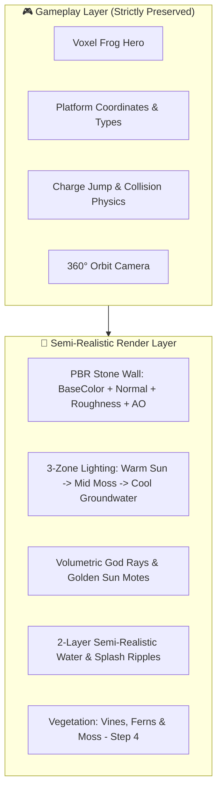

# กบในกะลา 3D (KOB in the Coconut Shell 3D)

> เกม 3D บนเบราว์เซอร์ด้วย **Three.js** พา "นายน้องกบ" ผู้รักความสงบในกะลามะพร้าวก้นบ่อน้ำหินโบราณ กระโดดไต่ชานหิน ไม้ และเห็ด เพื่อปีนขึ้นสู่ปากบ่อชมแสงตะวัน

---

## 🎨 ทิศทางงานภาพ (Art Direction)

ตัวเกมใช้คอนเซปต์ **Contrast Visual Design**:
* **ตัวละคร (Frog Hero):** สไตล์ **Low-Poly Papercraft 3D** (ปรับปรุงใหม่ตามต้นแบบ): โครงสร้างโพลีกอนตัดเหลี่ยมมนเปเปอร์คราฟต์ (`flatShading: true`), โทนสีเขียวใบไม้สดใสตัดกับคางและพุงสีครีมงาช้างอบอุ่น, ดวงตากลมโตนูนเฉียง 12° พร้อมแววตา Catchlight สี่เหลี่ยมสีขาว, รูจมูกคู่, เท้าหน้าและเท้าหลังกางแผ่ 4 แฉกพร้อมปุ่มดูดหกเหลี่ยม (Hexagonal Suction Pads) ขยับแอนิเมชันพองคอหายใจ ย่อตัวชาร์จสปริง และแผ่ขากระโดดกลางอากาศอย่างมีชีวิตชีวา โดดเด่นตัดกับสภาพแวดล้อมก้นบ่อ
* **ฉากสภาพแวดล้อม (Environment):** สไตล์ **Semi-Realistic (~70% Realistic / 30% Stylized)** บ่อน้ำหินโบราณลึก 65 เมตร มอสเกาะตามร่องหิน ละอองความชื้น ลำแสงแดดส่องทะลุลงมาจากปากบ่อ และผิวน้ำก้นบ่อใสระยิบระยับ



---

## 🚀 จุดเด่น & ฟีเจอร์ที่พัฒนาแล้ว

### 1. ผนังหินโบราณ PBR (Step 1: PBR Wall System)
* รองรับ Texture Maps ครบชุด 4 แผนผัง:
  * **Albedo / Base Color:** ผิวหินแกรนิตโบราณ คราบความชื้นและมอสเขียว
  * **Normal Map:** ร่องรอยแตกและมิติก้อนหินลึกสมจริง
  * **Roughness Map:** ความมันวาวแตกต่างกันระหว่างเนื้อหินแห้งกับรอยเปียกชื้น
  * **Ambient Occlusion Map (AO):** เงามืดลึกตามรอยยาแนวระหว่างก้อนหิน
* **ไร้รอยต่อ 360° (Zero Seam):** ปรับจูน Texture Repeat ในอัตราส่วนเมตริก 1:1 แบบรอบวงสมบูรณ์ (แนะนำสเกล `6x9` หรือ `8x12`)
* รองรับทั้งการโหลดไฟล์รูปภาพภายนอก (`.webp`) และโหมด Fallback ออฟไลน์ไร้เซิร์ฟเวอร์ (`textures.js`)

### 2. ระบบแสง 3 โซนแนวตั้ง & ลำแสงพระอาทิตย์ (Step 2: Lighting & God Rays)
* **การไล่ระดับแสง 3 โซน (Vertical 3-Zone Lighting):**
  * ☀️ **โซนบน (ปากบ่อ 45m – 65m):** แสงแดดส่องกระทบผิวด้านข้าง ทำมุมตกกระทบเฉียงให้เห็นความนูนของหิน PBR อย่างชัดเจน
  * 🌿 **โซนกลาง (กลางบ่อ 20m – 45m):** แสงสะท้อนสีเขียวขี้ม้าชื้น ลึกลับ มีละอองหมอกลอยเอื่อย
  * 💧 **โซนล่าง (ก้นบ่อ 0m – 20m):** บรรยากาศดาร์ก เย็นตา แสงสะท้อนสีเขียวอมฟ้าจากผิวน้ำ
  * 🐸 **Frog Glow Light:** แสงไฟนุ่มนวลติดตัวกบ ช่วยให้มองเห็นตัวละครชัดเจนไม่จมไปกับเงามืด
* **ลำแสงพระอาทิตย์ (Volumetric God Rays):**
  * ใช้เทคนิคการไล่สี Vertex Colors Power Curve ($t^{1.85}$) ร่วมกับ Additive Blending ปากบ่อสว่างนวลตา ค่อย ๆ สลายตัวหายไปสู่ความมืด **ไร้รอยตัดขอบกระบอก**
  * ละอองแดดสีทอง (**Sun Motes**) ลอยเคว้งคว้างภายในลำแสง ให้มิติความลึกที่สมจริง
  * ทำงานลื่นไหล 60 FPS บนมือถือ ไม่ต้องพึ่งพา Post-processing Pass หนัก ๆ

### 3. ระบบผิวน้ำกึ่งสมจริง (Step 3: Semi-Realistic Water)
* **ผิวน้ำ 2 ชั้น (2-Layer Scrolling Normal Maps):**
  * Layer 1: คลื่นมวลน้ำเอื่อยความถี่ต่ำ เลื่อนไปทางทิศตะวันออกเฉียงใต้
  * Layer 2: ระลอกน้ำละเอียดความถี่สูง เลื่อนสวนทางไปทางทิศตะวันตกเฉียงเหนือ เกิดประกายเหลือบสะท้อนแสงแดดอย่างเป็นธรรมชาติ
* **มิติความลึก (Depth & Transparency):**
  * ผิวน้ำโปร่งแสง สีเขียวมรกตอมฟ้า (`0x073931`)
  * มองทะลุเห็นพื้นโคลนก้นบ่อหิน (`waterBed`) ที่ระดับ Y = 0.055m
  * เคลือบเงาผิวน้ำ (Clearcoat 0.88, Roughness 0.16) สะท้อนแสงแดดและขอบปากบ่อ
  * เศษแหนและพืชน้ำลอยกระเพื่อมขึ้นลงตามจังหวะผิวน้ำ
* **ระบบคลื่นกระเพื่อมเมื่อตกน้ำ (Dynamic Splash Ripples):**
  * ตรวจจับความเร็วตอนกบตกน้ำ ยิ่งตกจากที่สูง ยิ่งเกิดระลอกคลื่นวงซ้อนขยายตัวกว้างขึ้น
  * ละอองน้ำสีฟ้าใสกระเด็นลอยขึ้นตามแรงเฉื่อยและตกลงตามแรงโน้มถ่วง พร้อมเสียงน้ำจ๋อม

### 4. ระบบพืชพรรณและเถาวัลย์ (Step 4: Vegetation Systems) — คุม Draw Calls ด้วย InstancedMesh
* **ก้อนมอส 3 มิติ (Moss Cushions):** ก้อนมอสนุ่มแบนเกาะแนบผนังร่องหิน 2 โทนสี (เขียวเข้มชื้นก้นบ่อ + กำมะหยี่เขียวตองรับแดด) เรนเดอร์ด้วย `InstancedMesh` รวมเพียง 2 Draw Calls
* **เฟิร์น 2 รูปแบบ (2 Fern Variants):**
  * *Variant 1 (Wall-Crevice Fan Fern):* พุ่มเฟิร์นคลี่บาน 3 แฉกแทรกตัวตามร่องยาแนวหิน
  * *Variant 2 (Drooping Shelf Fern):* ใบเฟิร์นโค้งห้อยย้อยลงมาตามขอบชานพัก
* **เถาวัลย์ 3 สายพันธุ์ (3 Vine Variants):**
  * *Variant 1 (Creeping Ivy):* เถาวัลย์เลื้อยแนบผนังทรงกระบอกพร้อมใบไอวี่เกาะตลอดแนว
  * *Variant 2 (Hanging Lianas):* เถาวัลย์ห้อยทิ้งตัวดิ่งลงมาจากปากบ่อด้านบน
  * *Variant 3 (Twisted Tendrils):* กิ่งเถาวัลย์ขดเกลียวสั้นในซอกหินชื้น
* **รากไม้โบราณ (Ancient Gnarled Roots):** รากไม้ใหญ่บิดเกลียวจากป่าด้านบนเลื้อยลงมาในปากบ่อ มีปลายรากและผิวสัมผัสเปลือกไม้สมจริง
* **ใบบัวและใบไม้ลอยน้ำ (Floating Lily Pads):** ใบบัวมีรอยหยัก V-notch ตามธรรมชาติ ลอยเอื่อยบนผิวน้ำก้นบ่อและกระเพื่อมขึ้น-ลงตามผิวน้ำอย่างแนบเนียน

### 5. ก้อนหิน 3 มิติยื่นจริง & ระดับคุณภาพกราฟิก (Step 5: 3D Stone Details & Quality Presets)
* **ก้อนหินขอบปากบ่อ (Coping Rim Stones):** ก้อนหินโพลีกอนตัดเหลี่ยมรอบปากบ่อที่ระดับความสูง 65 เมตร สร้าง Silhouette ขอบบ่อที่ขรุขระเป็นธรรมชาติรับกับแสงตะวัน
* **ก้อนหินยื่นตามผนัง (Protruding Wall Stones):** ก้อนหินทรงเรขาคณิตตัดเหลี่ยมมนยื่นออกมาจากผนังทรงกระบอก 0.15m – 0.32m ตลอดความสูงของบ่อ ลบความเรียบแบนของผนังทรงกระบอก ให้มิติลึกสมจริง
* **คานหินรองชานพัก (Corbel Stone Wall Brackets):** ใต้ชานพักหินและไม้ทุกจุดมีคานหินโบราณยื่นออกมาจากผนังบ่อรองรับตัวชานพัก ให้ความรู้สึกแข็งแรงและสมเหตุสมผลตามหลักสถาปัตยกรรม
* **เรนเดอร์ประหยัดด้วย `InstancedMesh`:** ก้อนหิน 3D และคานหินทั้งหมดใช้ Draw Call รวมเพียง 2 ครั้ง
* **สวิตช์ปรับระดับคุณภาพ 3 ระดับ (Quality Presets):**
  * `⚡ LOW` (โหมดประหยัดพลังงาน): DPR 1.0x, ปิดเงา Shadow Map, ซ่อนก้อนหิน 3D ยื่นจริง, ลดอนุภาคละออง เหมาะสำหรับมือถือรุ่นประหยัด
  * `✨ MEDIUM` (โหมดมาตรฐาน - ค่าเริ่มต้นบนมือถือ): DPR 1.5x, เปิดเงา Soft Shadow, ก้อนหิน 3D และพืชพรรณครบถ้วน ลื่นไหล 60 FPS
  * `🌟 HIGH` (โหมดความละเอียดสูง - สำหรับ PC/Retina): DPR 2.0x, เงา Soft Shadow ละเอียดสูง, อนุภาคละอองแดดและหมอกจัดเต็ม
* **สลับได้ทันทีแบบ Real-time:** มีปุ่ม `[⚡ MED]` ที่แถบด้านบนสำหรับกดวนสลับโหมดได้ตลอดเวลา และจำการตั้งค่าผ่าน `localStorage`

### 6. ระบบ WebApp (PWA) & ฐานข้อมูลตารางคะแนน (SQL Leaderboard)
* **Progressive Web App (PWA):**
  * มี `manifest.json` กำหนดธีมสีเขียวเข้มก้นบ่อ (`#042518`), โหมด Fullscreen Standalone, หน้าจอล็อคแนวตั้ง (Portrait)
  * มี `sw.js` (Service Worker) แคชไฟล์เกมและ Texture ไว้ในเครื่อง เล่นแบบ Offline ได้ 100%
  * ปุ่ม **`[📲 ติดตั้งแอป]`** แสดงอัตโนมัติบนเบราว์เซอร์ที่รองรับ ติดตั้งลงหน้าโฮมมือถือได้เสมือน Native App
* **โครงสร้างฐานข้อมูล SQL (`schema.sql`):**
  * ตาราง `leaderboard` จัดเก็บ: `player_name` (ชื่อผู้เล่น), `max_height` (ความสูงสูงสุดที่ทำได้), `clear_time_seconds` (เวลาที่ใช้เคลียร์/เล่น), `jump_count` (จำนวนครั้งที่กระโดด), `is_escaped` (หลุดพ้นปากบ่อสำเร็จหรือไม่), `device_type` (อุปกรณ์), `created_at` (วันเวลา)
  * ดัชนี `idx_leaderboard_rank` เรียงลำดับตามความสูงสูงสุด (`max_height DESC`) และเวลาที่เร็วที่สุด (`clear_time_seconds ASC`)
* **REST API & Node.js Server (`server.js`):**
  * รันผ่าน Node.js ในตัวด้วยโมดูลมาตรฐาน `node:sqlite` ไม่ต้องติดตั้ง npm packages เพิ่มเติม
  * โหมดสองประสาน (Dual-mode): เชื่อมต่อ SQLite เมื่อรันเซิร์ฟเวอร์ และสลับไปใช้ `localStorage` ทันทีเมื่อเปิดไฟล์เดี่ยว

---

## 📁 โครงสร้างโปรเจกต์ (Project Structure)

```text
KobInKALA/
├── index.html                   # ไฟล์หลัก โครงสร้าง HTML, UI HUD, Leaderboard Modal, PWA Meta
├── style.css                    # สไตล์ CSS, Safe-area บนมือถือ, แอนิเมชัน UI
├── game.js                      # ตรรกะเกมหลัก: Three.js, ฟิสิกส์, ตัวจับเวลา, ตารางคะแนน
├── textures.js                  # Fallback WebP Base64 textures (รันไฟล์เดี่ยวได้ไม่ต้องต่อเน็ต)
├── server.js                    # WebApp Server + SQLite API (Node.js native, Zero dependency)
├── schema.sql                   # โครงสร้างฐานข้อมูล SQL เก็บชื่อ, ความสูง, เวลา, และสถิติ
├── manifest.json                # Web App Manifest สำหรับติดตั้ง PWA บนมือถือ/เดสก์ท็อป
├── sw.js                        # Service Worker รองรับ Offline Cache-First สมบูรณ์แบบ
├── README.md                    # เอกสารประกอบโปรเจกต์
│
└── images/                      # โฟลเดอร์รูปภาพ, ไอคอน PWA และ Textures
    ├── icon-192.png             # PWA App Icon (192x192)
    ├── icon-512.png             # PWA App Icon (512x512)
    ├── well_stone_basecolor.webp # PBR Texture: สีหินและมอส (1024x1024)
    ├── well_stone_normal.webp    # PBR Texture: แผนผังรอยแตกและความนูน (1024x1024)
    ├── well_stone_roughness.webp # PBR Texture: แผนผังความหยาบ/ความเงา (1024x1024)
    └── well_stone_ao.webp        # PBR Texture: แผนผังเงามืดตามซอกหิน (1024x1024)
```

---

## 🕹️ การเปิดเล่นและวิธีใช้งาน (How to Play & WebApp)

### วิธีเปิดเล่น (แนะนำ: รันเป็น WebApp & Leaderboard)
1. **รัน WebApp Server ด้วย Node.js (แนะนำที่สุด):**
   ```bash
   node server.js
   ```
   * ตัวเซิร์ฟเวอร์จะเปิดที่ `http://localhost:8000`
   * สร้างฐานข้อมูล SQLite `leaderboard.db` อัตโนมัติจาก `schema.sql` พร้อมข้อมูลเริ่มต้น
   * มี REST API: `GET /api/leaderboard` และ `POST /api/leaderboard`
   * รองรับการติดตั้งเป็น Progressive Web App (PWA) บนหน้าจอมือถือ (Add to Home Screen)
2. **เปิดตรงผ่านเบราว์เซอร์ (Offline file:/// หรือ Static Server):**
   * ดับเบิลคลิกเปิดไฟล์ `index.html` ได้ทันที
   * หากไม่ได้รันเซิร์ฟเวอร์ ระบบคะแนนจะสลับไปใช้ `localStorage` สำรองให้อัตโนมัติ เล่นได้ลื่นไหล 100% ไร้ข้อผิดพลาด

### การควบคุมบน Desktop
| ปุ่ม / เมาส์ | การกระทำ |
|---|---|
| **Spacebar (กดค้าง)** | ชาร์จพลังกระโดด (ดูแถบชาร์จด้านล่าง) |
| **Spacebar (ปล่อย)** | กระโดดตามแรงชาร์จ |
| **A / D หรือ ← / →** | หมุนหันหน้ากบไปตามทิศทางที่ต้องการ |
| **คลิกซ้ายแล้วลากเมาส์** | หมุนมุมกล้องอิสระรอบตัวกบ 360° |
| **Scroll เมาส์** | ซูมกล้องเข้า - ออก |
| **R** | รีเซ็ตกลับสู่ก้นบ่อ |

### การควบคุมบนมือถือ (Mobile Portrait First)
* **ปุ่ม ⮜ / ⮞:** กดค้างเพื่อหันกบซ้ายหรือขวา
* **ปุ่ม 🚀 ชาร์จกระโดด:** แตะค้างเพื่อสะสมพลังกระโดด แล้วปล่อยนิ้วเพื่อกระโดด
* **ลากนิ้วบนหน้าจอ:** หมุนมุมกล้องรอบบ่อ 360° (รองรับระบบตัดทะลุกำแพง BackSide)
* **จีบนิ้ว 2 นิ้ว (Pinch Zoom):** ซูมเข้า - ออกดูรายละเอียดพื้นผิว
* **Safe-area Protection:** ปุ่มควบคุมด้านล่างถูกยกเว้นระยะห่าง เพื่อไม่ให้ชน Gesture Navigation Bar ของโทรศัพท์

---

## 🧱 แผงตรวจสอบฉาก PBR, แสง & น้ำ (PBR Inspector)

กดปุ่ม **`[🧱 6x9]`** ที่มุมขวาบนของหน้าจอเพื่อเปิดแผงควบคุมทดสอบ:

1. **สเกลหิน & รอยต่อ (Repeat & Seams):**
   * `6x9 โต`: ก้อนหินขนาดใหญ่ สัดส่วน 1:1 ไร้รอยต่อแนวตั้ง (แนะนำ)
   * `8x12 ถี่`: หินก้อนขนาดกลาง เรียงตัวแน่น
   * `3.2 เดิม`: สเกลเดิมแบบ Stylized
2. **แยกทดสอบ PBR Maps:**
   * สลับเปิด/ปิด `Normal`, `Roughness`, `AO` แยกชิ้น เพื่อดูผลลัพธ์ของแต่ละ Map
3. **ตรวจสอบความลึกระดับต่าง ๆ (Height Inspection):**
   * กระโดดมุมกล้องไปที่ `ก้นบ่อ` (0.5m), `กลางบ่อ` (30m), `ปากบ่อ` (58m) หรือกลับมาจับที่ `ตัวกบ`
4. **ซูมดูเนื้อหิน:** ปุ่ม `+` และ `-` สำหรับขยายส่องผิวหินแบบระยะประชิด
5. **แสง & ลำแสง (STEP 2):**
   * ปุ่มเปิด/ปิด `God Rays` และ `Sunlight` เพื่อเทียบความต่างของแสงเงา
6. **ผิวน้ำกึ่งสมจริง (STEP 3):**
   * `💧 ซูมก้นบ่อ (0.4m)`: ล็อคมุมกล้องระดับสายตาผิวน้ำ
   * `🌊 ทดสอบจ๋อมน้ำ`: จำลองระลอกคลื่นน้ำกระจายและละอองน้ำกระเซ็นทันที
7. **พืชพรรณ & เถาวัลย์ (STEP 4):**
   * ปุ่มเปิด/ปิด `พืชพรรณ` เพื่อดูความแตกต่างระหว่างผนังหินล้วนกับผนังที่มีพืชเกาะ
   * `🌿 กลางบ่อ (30m)`: กระโดดมุมกล้องไปส่องดงเฟิร์น มอส และเถาวัลย์กลางบ่อน้ำ
8. **ก้อนหิน 3D ยื่นจริง (STEP 5):**
   * ปุ่มเปิด/ปิด `หิน 3D`: สลับดูก้อนหินยื่นจริงและคานรองชานพัก
   * `🧱 ปากบ่อ (58m)`: กระโดดมุมกล้องไปส่องหินขอบปากบ่อ แสงตะวัน และรากไม้
9. **ระดับกราฟิก (Quality Presets):**
   * `⚡ LOW`: ปิดเงา Shadow, DPR 1.0x, ซ่อนก้อนหิน 3D ยื่นจริง ประหยัดแบตเตอรี่
   * `✨ MED`: เงา Soft Shadow, DPR 1.5x, ก้อนหินและพืชพรรณครบถ้วน (มาตรฐานมือถือ)
   * `🌟 HIGH`: เงาความละเอียดสูง, DPR 2.0x, ละอองแสงและเอฟเฟกต์เต็มพิกัด (PC/จอ Retina)

---

## 🗺️ แผนการพัฒนา (Development Roadmap)

- [x] **STEP 1: PBR Wall Material & Seam Fix**
  - แก้ไขรอยต่อ Seam บนรูปทรงกระบอกสูบ
  - แก้ไข Stone Ratio 1:1 เมตริก
  - สร้างแผงควบคุม Inspector สำหรับตรวจสอบ
- [x] **STEP 2: 3-Zone Lighting & God Rays**
  - แสงแดดส่องเฉียงปากบ่อ (Upper Zone)
  - แสงสะท้อนสีเขียวชื้นกลางบ่อ (Middle Zone)
  - แสงสะท้อนสีเขียวอมฟ้าก้นบ่อ (Bottom Zone)
  - ลำแสงพระอาทิตย์ทรงกรวยไล่สีแบบ Power Curve + ละอองแดดสีทอง (Sun Motes)
- [x] **STEP 3: Semi-Realistic Water**
  - ผิวน้ำ PBR ไหลวน 2 ชั้น (2-Layer Scrolling Normal Maps)
  - ความลึกโปร่งแสงมองเห็นพื้นโคลนก้นบ่อ
  - ระบบคลื่นน้ำกระเพื่อมและละอองน้ำกระเซ็นเมื่อกบตกน้ำ (Splash Ripples)
- [x] **STEP 4: Vegetation**
  - เถาวัลย์ 3 สายพันธุ์ (Creeping Ivy, Hanging Lianas, Twisted Tendrils)
  - พุ่มเฟิร์น 2 รูปแบบ (Fan Ferns & Drooping Shelf Ferns)
  - รากไม้โบราณบิดเกลียว (Gnarled Roots) และก้อนมอส 3 มิติ 2 โทนสี
  - ใบบัว/ใบไม้ลอยน้ำพร้อม V-notch ขยับตามจังหวะคลื่นน้ำ
  - ควบคุมประสิทธิภาพด้วย `THREE.InstancedMesh` (~60 FPS บนมือถือ)
- [x] **STEP 5: 3D Stone Details & Quality Presets**
  - เพิ่ม Geometry ก้อนหินยื่นจริงบริเวณปากบ่อและชานพัก
  - สวิตช์ปรับระดับคุณภาพ: `LOW` (มือถือสเปกประหยัด), `MEDIUM` (มาตรฐาน), `HIGH` (พีซี/จอละเอียดสูง)
